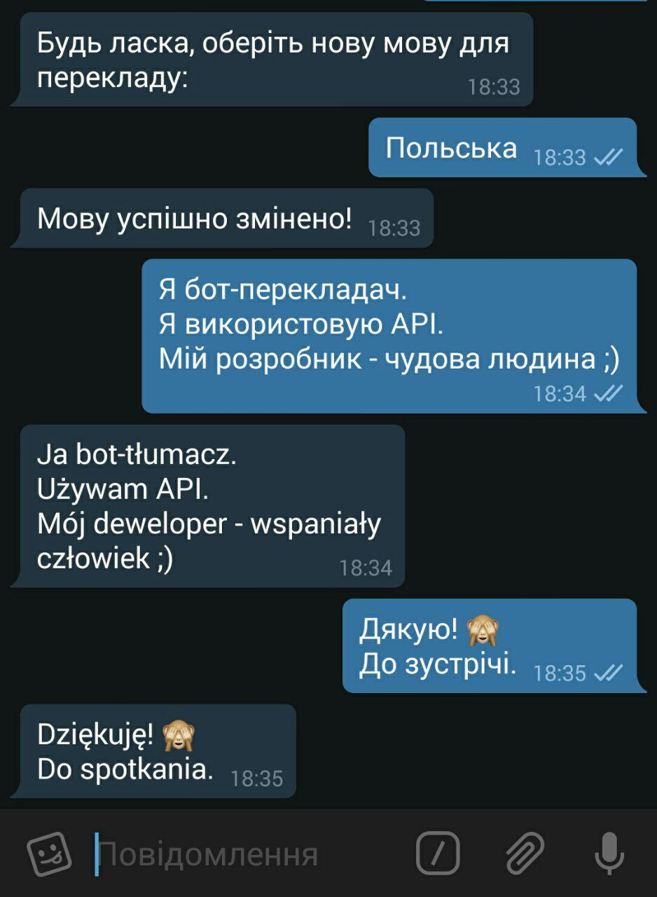

# Telegram-Bot-Translator

Telegram bot which allow you translate text in 90 languages of world.
Realized by using Yandex.Translate API and Telegram API.

Realized by **Python 3.5**

## Deploy:

1. `pip install -r requirements.txt`

1. `Put your Telegram-token and Yandex.Translate-token in config.py`

1. `Run bot.py`

## My profiles:
 - [VK](https://vk.com/victoria_1807)
 - [Telegram](https://telegram.me/Victoria1807)
 - [GitHub](https://github.com/Victoria1807)
 - E-mail - flamaster1807@gmail.com

